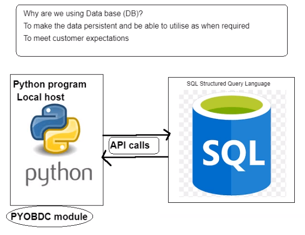

# Python and SQL

Why use Databases?
- To make data persistent
- Used only when required basis
- Meet customer expectations

Python and SQL servers communicate with each other via _API Calls_



## PYODBC
Using PYODBC module (**O**pen **D**ata**B**ase **C**onnectivity) to connect to SQL from a Python program

- ODBC is the primary native data access API for applications written in C and C++ for SQL Server

**Cursors**
- Cursor class represents a cursor to iterate through instances of a specified class, the result set of a find/search operation, or the result set from SQL queries

After installing pyodbc: ``pip install pyodbc``


**Establish A Connection**
```python
import pyodbc

# connect to Northwind DB
server = "databases1.spartaglobal.academy"
database = "Northwind"
username = "USERNAME"
password = "PASSWORD"


# server name, DB name, username, and password are required to connect with pyodbc
northwind_connection = pyodbc.connect(
    f"DRIVER=ODBC Driver 17 for SQL Server;SERVER={server};DATABASE={database};UID={username};PWD={password}"
)
```

**RUNNING A QUERY**
```python
cursor = northwind_connection.cursor()

# .execute(statement) executes an SQL statement
cursor.execute("SELECT @@VERSION")
# select version of current DB
# fetch one retrieves one row
raw = cursor.fetchone()
print(raw)
```
Querying from Customers Table
```python
# In DB use Customers table
# fetch all retrieves all rows
customer_data = cursor.execute("SELECT * FROM Customers;").fetchall()

for customer_record in customer_data:
    print(customer_record)
    print(type(customer_record))
```

Combination of loop and control flow to ensure only iterating through data as long as data is available
```python
while True:
    records = customer_data.fetchone()
    # when there are no records left (value is None) stop
    if records is None:
        break
    print(records.UnitPrice)
```

Summary
- pyodbc installation and connection set up
- cursor utilisation
- ``fetchone()``: Selects one record
- ``fetchall()``: Selects all records